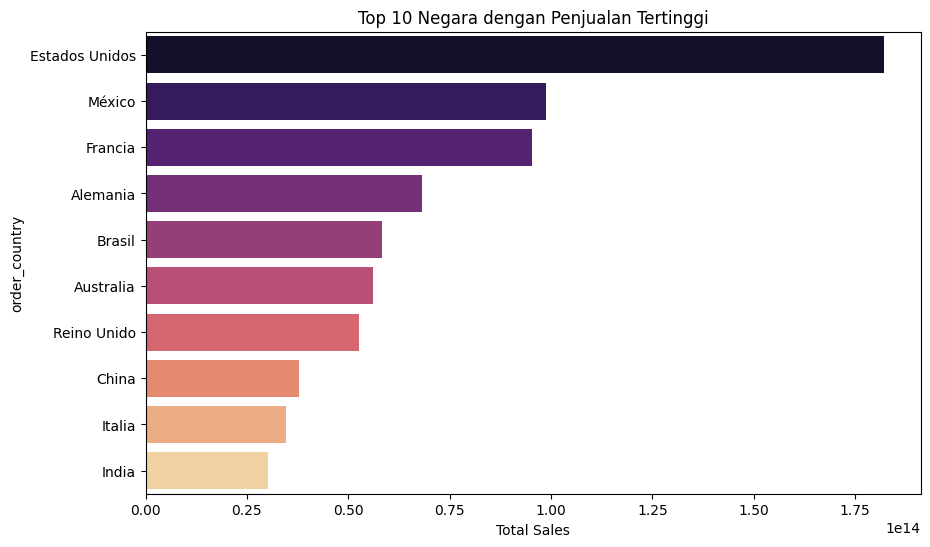
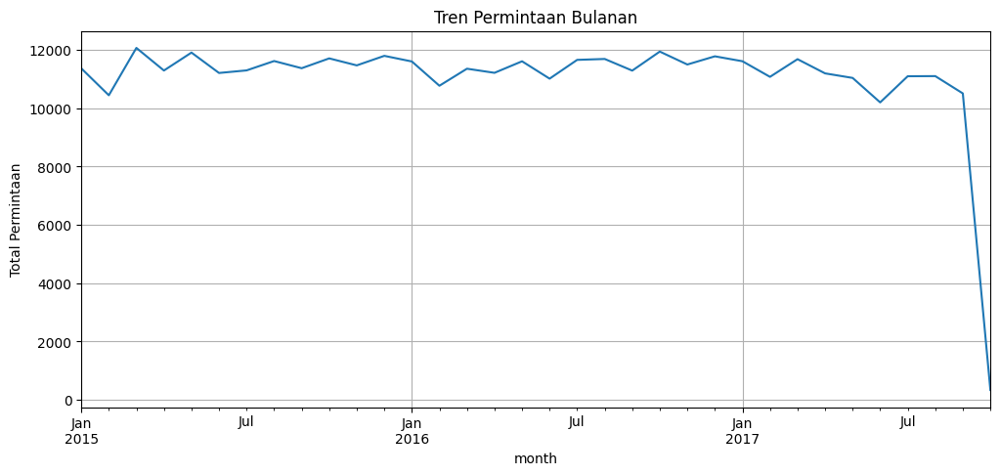
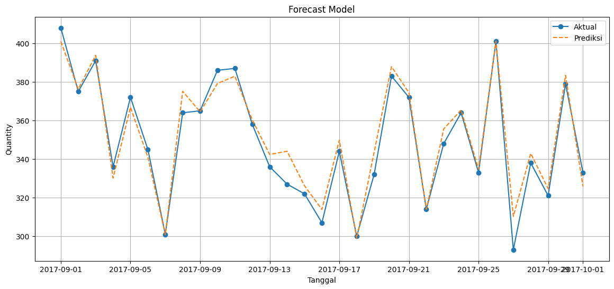
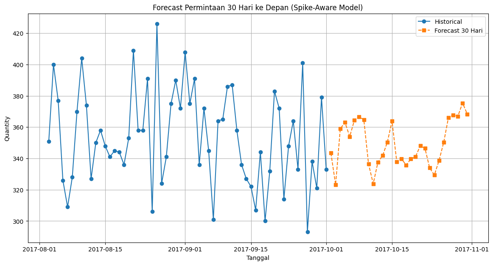

## Supply Chain Analytics & Profit Prediction using Ensemble Regressor

  
  
  
  
  

Di era Industri 4.0, efisiensi rantai pasok (supply chain) sangat bergantung pada kemampuan perusahaan dalam mengolah data besar (Big Data). Proyek ini bertujuan untuk melakukan analisis mendalam dan prediksi metrik finansial pada sistem rantai pasok global menggunakan teknik Machine Learning untuk mengoptimalkan pengambilan keputusan operasional.

### Table of Contents

- [Dataset](#dataset)
- [Libraries](#libraries)
- [Data Cleaning & Preprocessing](#data-cleaning--preprocessing)
- [Exploratory Data Analysis](#exploratory-data-analysis)
- [Models](#models)
- [Results](#results)
  - [1. Backtesting (-1 Bulan Data)](#1-backtesting--1-bulan-data)
  - [2. Walk-Forward Validation](#2-walk-forward-validation)
  - [3. Real-World Prediction (Implementation)](#3-real-world-prediction-implementation)
- [Conclusions & Recommendations](#conclusions--recommendations)

### Dataset
Dataset yang digunakan dalam proyek ini adalah DataCo Smart Supply Chain, yang dapat diakses melalui [Kaggle](https://www.kaggle.com/datasets/shashwatwork/dataco-smart-supply-chain-for-big-data-analysis). .

Dataset ini terdiri dari sekitar 181.000 baris data dengan 52 kolom yang mencakup aspek logistik, informasi pelanggan, dan transaksi finansial. Beberapa kolom kunci meliputi:

* Days for shipping (real) : Durasi pengiriman aktual.
* Benefit per order : Keuntungan yang diperoleh per pesanan.
* Sales : Total nilai penjualan.
* Delivery Status : Status keberhasilan pengiriman.
* Late_delivery_risk : Indikator risiko keterlambatan.
* Order Country/City : Lokasi geografis pemesanan.

### Libraries
Proyek ini menggunakan ekosistem data science Python untuk pemrosesan dan pemodelan:

<pre>
import pandas as pd
import numpy as np
import matplotlib.pyplot as plt
import seaborn as sns
from xgboost import XGBRegressor
from sklearn.ensemble import RandomForestRegressor
from sklearn.linear_model import LinearRegression, Ridge
from sklearn.preprocessing import StandardScaler
from sklearn.metrics import mean_squared_error, mean_absolute_error
</pre>

### Data Cleaning & Preprocessing
Sebelum masuk ke tahap pemodelan, data melalui proses cleaning yang ketat:
* Currency Parsing: Membersihkan simbol mata uang ($) dan karakter non-numerik pada kolom finansial agar dapat diolah secara matematis.
* Outlier Handling: Menggunakan metode Interquartile Range (IQR) untuk mendeteksi anomali. Sebanyak 124 titik data ekstrem pada kolom permintaan dihapus untuk menjaga stabilitas model.
* Feature Engineering: Transformasi data waktu (order date) ke format datetime dan standarisasi fitur menggunakan StandardScaler.

### Exploratory Data Analysis
Analisis visual dilakukan untuk memahami pola distribusi pasar dan tren penjualan.
* Geospatial Analysis: Identifikasi 10 negara dengan volume penjualan tertinggi untuk menentukan fokus pasar.

 

* Demand Trend: Analisis fluktuasi permintaan bulanan untuk melihat pola musiman dalam rantai pasok.

 

### Models
Proyek ini membandingkan beberapa algoritma regresi untuk mendapatkan akurasi prediksi terbaik terhadap nilai keuntungan (profit) dan penjualan:
* Linear Regression & Ridge: Sebagai model dasar (baseline) untuk melihat hubungan linear antar variabel.
* Random Forest Regressor: Algoritma ensemble berbasis tree untuk menangani kompleksitas data.
* XGBoost Regressor: Algoritma Gradient Boosting tingkat lanjut yang dioptimalkan untuk performa tinggi dan akurasi yang lebih presisi pada dataset besar.

### Results

Evaluasi model dilakukan melalui tiga tahapan pengujian yang ketat untuk memastikan stabilitas dan akurasi prediksi sebelum diimplementasikan pada data riil.

#### 1. Backtesting Model (-1 Bulan Data)
Pada tahap ini, model diuji dengan menyisihkan satu bulan terakhir dari dataset sebagai data uji (unseen data). Hal ini bertujuan untuk melihat sejauh mana kemampuan model dalam memprediksi pola yang belum pernah dipelajari sebelumnya.

**Metrik Evaluasi:**
* **RMSE:** 6.7078
* **MAE:** 5.1569
* **MAPE:** 1.51%

**Tabel Hasil Uji (Sampel 15 Hari):**

| Tanggal | Aktual | Prediksi | Error |
| :--- | :---: | :---: | :---: |
| 2017-09-01 | 408 | 400.92 | 7.08 |
| 2017-09-02 | 375 | 376.28 | -1.28 |
| 2017-09-03 | 391 | 393.78 | -2.78 |
| 2017-09-04 | 336 | 330.17 | 5.83 |
| 2017-09-05 | 372 | 366.86 | 5.14 |
| 2017-09-06 | 345 | 340.97 | 4.03 |
| 2017-09-07 | 301 | 300.88 | 0.12 |
| 2017-09-08 | 364 | 375.15 | -11.15 |
| 2017-09-09 | 365 | 364.49 | 0.51 |
| 2017-09-10 | 386 | 379.18 | 6.82 |
| 2017-09-11 | 387 | 382.95 | 4.05 |
| 2017-09-12 | 358 | 360.30 | -2.30 |
| 2017-09-13 | 336 | 342.38 | -6.38 |
| 2017-09-14 | 327 | 344.04 | -17.04 |
| 2017-09-15 | 322 | 326.16 | -4.16 |

 

#### 2. Walk-Forward Validation
Untuk memastikan model tidak mengalami *overfitting* dan tetap konsisten pada periode waktu yang berbeda, dilakukan validasi Walk-Forward. Metode ini membagi data ke dalam beberapa jendela waktu (*sliding window*) untuk menguji ketahanan model secara dinamis.

| Window Index | RMSE | MAE | MAPE |
| :--- | :---: | :---: | :---: |
| Start Index 681 | 5.521 | 3.932 | 1.05% |
| Start Index 711 | 7.110 | 4.710 | 1.19% |
| Start Index 741 | 8.239 | 5.505 | 1.48% |
| Start Index 771 | 7.056 | 5.723 | 1.56% |
| Start Index 801 | 7.306 | 5.558 | 1.57% |
| Start Index 831 | 15.160 | 10.295 | 3.19% |
| Start Index 861 | 13.226 | 10.334 | 3.11% |
| Start Index 891 | 6.729 | 5.604 | 1.60% |
| Start Index 921 | 5.816 | 4.516 | 1.25% |
| **Rata-Rata (Mean)** | **8.463** | **6.242** | **1.78%** |

#### 3. Real-World Prediction (Implementation)
Setelah melalui proses validasi dan dipastikan memiliki tingkat *error* yang rendah (Mean MAPE < 2%), model diimplementasikan untuk memprediksi nilai riil pada periode mendatang (Oktober 2017).

**Hasil Prediksi Riil:**

| Tanggal | Forecast Value |
| :--- | :---: |
| 2017-10-02 | 343.45 |
| 2017-10-03 | 323.23 |
| 2017-10-04 | 359.07 |
| 2017-10-05 | 362.97 |
| 2017-10-06 | 353.95 |
| 2017-10-07 | 364.47 |
| 2017-10-08 | 366.54 |
| 2017-10-09 | 364.81 |
| 2017-10-10 | 336.50 |
| 2017-10-11 | 323.83 |
| 2017-10-12 | 337.60 |
| 2017-10-13 | 341.84 |
| 2017-10-14 | 350.32 |
| 2017-10-15 | 363.85 |
| 2017-10-16 | 337.94 |
| 2017-10-17 | 339.83 |
| 2017-10-18 | 335.74 |
| 2017-10-19 | 339.63 |
| 2017-10-20 | 341.17 |
| 2017-10-21 | 348.04 |
| 2017-10-22 | 346.53 |
| 2017-10-23 | 333.95 |
| 2017-10-24 | 329.41 |
| 2017-10-25 | 338.68 |
| 2017-10-26 | 350.39 |
| 2017-10-27 | 366.16 |
| 2017-10-28 | 367.81 |
| 2017-10-29 | 366.96 |
| 2017-10-30 | 375.43 |
| 2017-10-31 | 368.37 |

 
